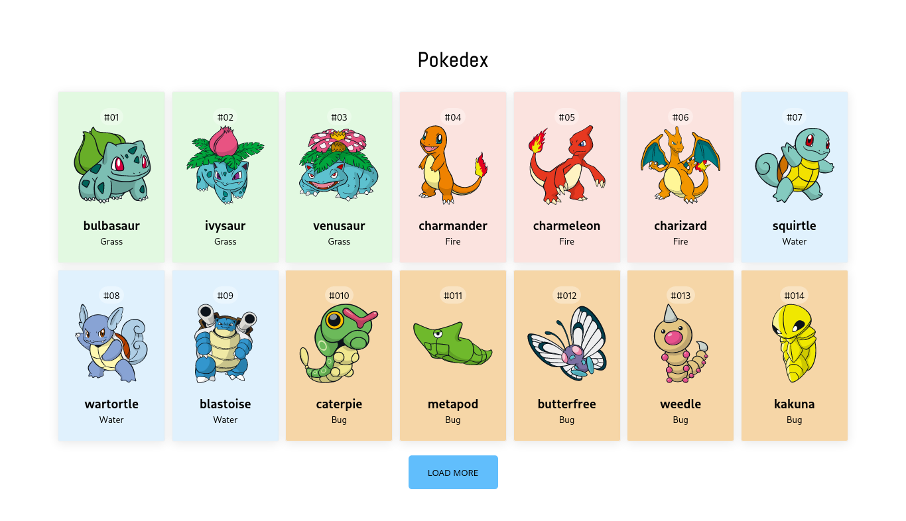

# Pokedex Project



> O projeto consiste em uma aplicação que simula um pokedex utilizando React e React Hooks.

## 💻 Pré-requisitos

Para usar, verifique os seguintes requisitos:

- Você instalou a versão mais recente de `NodeJs e NPM`

## 🚀 Instalando o Pokedex Project

Para instalar o projeto, clone o repositório e siga estas etapas:

Instalar dependências:

```
npm i
```

Iniciar projeto:

```
npm start
```

⚠️ Obs.: Caso não tenha as ferramentas acima, você pode acessar a aplicação <a href="https://pokedex-project-jet.vercel.app/" >aqui</a>

## ☕ Usando Pokedex Project

Uma vez com a aplicação iniciada em seu navegador, basta visualizar uma pokedex incrível.

## 📫 Contribuindo para o Pokedex Project!

1. Clone este repositório.
2. Crie uma branch: `git checkout -b nome-da-branch`.
3. Faça suas alterações e confirme-as: `git commit -m 'mensagem-de-commit'`
4. Envie para o branch original: `git push origin nome-do-projeto / local`
5. Crie a solicitação de pull request.

Como alternativa, consulte a documentação do GitHub em [como criar uma solicitação pull](https://help.github.com/en/github/collaborating-with-issues-and-pull-requests/creating-a-pull-request).

[⬆ Voltar ao topo](#pokedex-project)<br>
